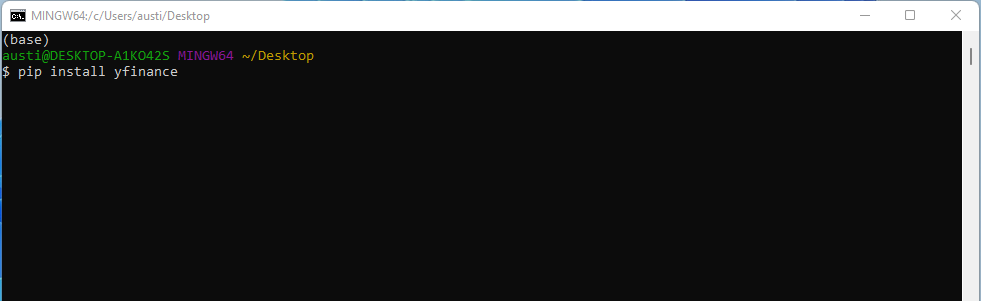
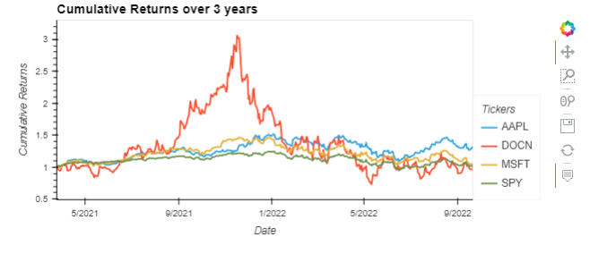

## Quantitative anaylsis
"Quantative analysis on stocks" is a program for investors and traders to make buying and selling decisions by studying and evaluating past and current data, investors and traders attempt to gain an edge in the markets by making informed decisions.

There are two basic types of stock analysis: fundamental analysis and technical analysis. Fundamental analysis concentrates on data from sources, including financial records, economic reports, company assets, and market share. 

The second method of stock analysis is technical analysis. Technical analysis focuses on the study of past and present price action to predict the probability of future price movements.
With that in mind, this application provides users with stock analysis for any stock for which input is given by users. The purpose is to provide users with stock information and not a prediction.


## Outline

- [Overview](#Overview)
- [Visuals](#Visuals)
- [Supported Data Sources](#Supported-Data-Sources)
- [Installation](#Installation)
- [Usage](#Usage)
- [LICENSE](#LICENSE)

## Overview
Stock data analysis has 10 ways to interact with the market and provide chosen data in a readable format including hvplots and graphs
using the yahoo fin api in real time.


## Supported Data Sources

|Data Source |Type |Range and Frequency |Request Limits|Raw Data|Preprocessed Data|
|  ----  |  ----  |  ----  |  ----  |  ----  |  ----  |
|[YahooFinance](https://pypi.org/project/yfinance/)| US Securities| Frequency-specific, 1min| 2,000/hour| OHLCV | Prices&Indicators|


## Installation

First well install yahoo finance using pip install yfinance by navigating to your terminal and typing the following.



If you are using an anaconda or a conda environment chances are pandas, hvplot and jupyter labs are already installed in your virtual environment.  

For a full install activate a conda development environment and run in GitBash if not already installed:
```python
    conda install pandas
    conda install jupyterlab
    conda install -c pyviz hvplot
```
Check the to make sure everything has been installed properly
```python
    conda list pandas
    conda list hvplot
    conda list jupyter lab
```

## Usage

To run this jupyter lab notebook you will need to use GitBash and navigate to where you have exported the files associated with this project and activate your dev environment.
```python
    cd <your-file-path-here>
    
    conda activate <your-dev-environment>

```

This will open your default web browser and a jupyter labs notebook in your selected file.

Make sure to follow the markdown cells that have been displayed to follow the analysis

There are a few interactive graphs for the stocks you run, which you can see examples of below

---




